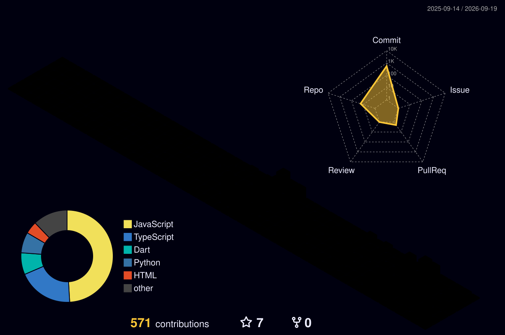
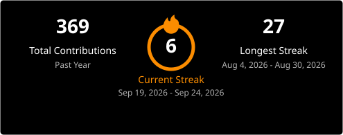

# Anmol Garg

AI/ML Engineer &nbsp;·&nbsp; Systems Builder &nbsp;·&nbsp; Full-Stack

 

## About

3rd-year B.Tech AI & Data Science student at VIPS Delhi, currently interning as a Software Engineer at **7rd.ai**, where I build the Windows ground-control application (Electron, React, TypeScript) for an autonomous drone defense platform, and maintain an autonomous AI agent running on production infrastructure that cut manual operational work by roughly 40%.

I work across the stack that sits between a model and a shipped product — training and deploying ML systems, building the APIs and backends around them, and the interfaces people actually use. Outside coursework and the internship, I build independent projects end-to-end: IoT hardware, NLP pipelines, autonomous detection systems, and full-stack applications.

---

## Recognition

- **India Innovates 2026** — National Finalist
- **Samsung Solve for Tomorrow 2025** — Top 10 nationally, from 20,000+ competing teams
- **Supernova Hackathon, GL Bajaj (2025)** — 1st Place
- **Google Student Ambassador 2026** — 1 of ~50 selected nationally

---

## Projects

### [AIRAVAT XDR](https://github.com/Chaitanyasethi1/XDR_hack) — Autonomous AI Cyber Defense Platform
National Finalist, India Innovates 2026. Combines Isolation Forest anomaly detection with an NLP phishing classifier into a single risk-scoring engine, feeding an automated response system (account lockdown, device isolation). Sub-2s response latency, under 5% false-positive rate. Backend in FastAPI, dashboard in React.
`Python` `FastAPI` `React` `Scikit-learn` `NLP` — [Live demo](https://www.airavatxdr.in/)

### [SAMARTH-AI](https://github.com/AnmolGarg8/AiKOSH) — Government Taxonomy Classifier
Full-stack NLP system that maps plain-language product descriptions to 500+ government taxonomy categories — 80% accuracy, cutting manual classification effort by 70% and processing time from 10+ minutes to under a second.
`Python` `FastAPI` `React` `NLP`

### [NoteNetra](https://github.com/AnmolGarg8/Note) — Offline IoT Cash Tracking
Top 10, Samsung Solve for Tomorrow 2025. ESP32-based system that digitizes informal shopkeeper cash transactions into structured, bank-ready credit data — built and validated with real shopkeepers, targeting 1,000+ daily transactions.
`ESP32` `C++` `Python`

### [PulmoWarn](https://github.com/AnmolGarg8/Pulmowarn) — Respiratory Monitoring Concept
Dual-sensor (acoustic + CO₂) prototype for early detection of respiratory deterioration, with real-time visualization built on the Canvas API and no external charting libraries.
`JavaScript` `Canvas API`

---

## Stack

**Languages** — Python, C++, Java, JavaScript, TypeScript

**AI / ML / LLM** — PyTorch, TensorFlow, scikit-learn, LangChain, HuggingFace, OpenAI API

**Full-Stack & Infra** — React, Next.js, FastAPI, Electron, AWS, Docker, Linux, Git

**Hardware / IoT** — ESP32, Embedded C/C++

---

## GitHub Activity

  

---

## Currently

Working on LLM/RAG application architecture, agent reliability, and the systems layer around production AI — Docker, cloud infra, and distributed systems. Open to AI/ML and software engineering internship and research conversations.

